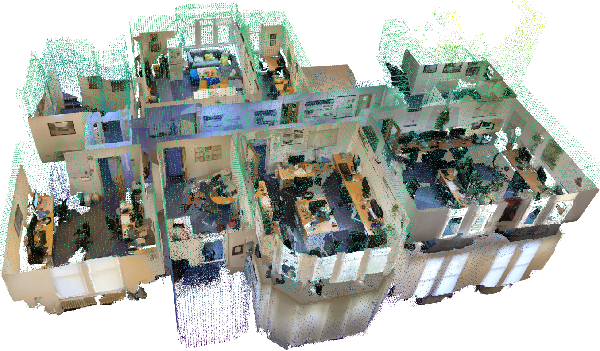
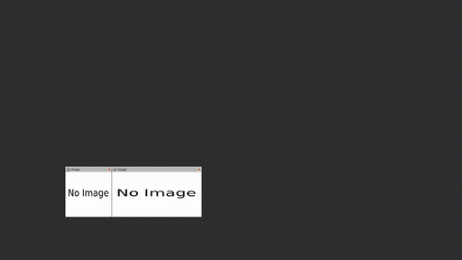
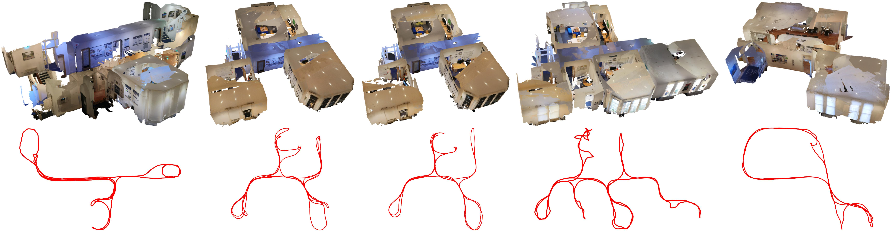

<div align="center">
  <h1>ScaRF-SLAM🧣: Scale-Consistent Reconstruction with Feed-Forward Models and Classical Visual SLAM</h1>
  <p>
    <a href="https://yuhaozhang7.github.io" target="_blank">Yuhao Zhang</a><sup>1</sup>,
    <a href="https://yifutao.github.io/" target="_blank">Yifu Tao</a><sup>1</sup>,
    <a href="https://scholar.google.com/citations?user=ZxXBaswAAAAJ&hl=en&oi=ao" target="_blank">Frank Dellaert</a><sup>2</sup>,
    <a href="https://scholar.google.com/citations?user=BqV8LaoAAAAJ&hl=en&oi=ao" target="_blank">Maurice Fallon</a><sup>1</sup><br>
    <sup>1</sup>Dynamic Robot Systems Group, University of Oxford &nbsp;&nbsp;
    <sup>2</sup>Georgia Institute of Technology
  </p>

  <!-- []()
  []()
  []() -->

  
</div>

ScaRF-SLAM is a dense visual mapping framework that combines the robustness of classical visual SLAM with the reconstruction capability of modern geometric foundation models (GFMs). Instead of relying on learned geometry for camera tracking, ScaRF-SLAM decouples localization and dense mapping: classical SLAM provides accurate, low-latency pose estimation, while GFMs are used exclusively for feed-forward depth prediction and reconstruction. By anchoring dense mapping to reliable SLAM poses and enforcing lightweight scale-consistency optimization across frames and submaps, the system achieves globally consistent, high-quality 3D reconstruction while remaining robust to limited batch sizes and loop closures. The framework is compatible with a wide range of SLAM configurations — including monocular, stereo, mono-inertial, multi-camera, and fisheye-camera systems — making it practical for real-world robotics and large-scale mapping applications.

## Table of Contents

- [🎬 Preview](#-preview)
- [📦 Environment Setup](#-environment-setup)
- [📷 Dataset](#-dataset)
- [🗺️ Offline Reconstruction](#-offline-reconstruction)
- [🚀 Online Reconstruction with SLAM](#-online-reconstruction-with-slam)
- [🔀 Multi-Session Mapping](#-multi-session-mapping)
- [⚙️ Configuration](#-configuration)
- [📐 Evaluation](#-evaluation)

## 🎬 Preview 

<div align="center">
  
  
  <br>
  
  
</div>

## 📦 Environment Setup

### Create Conda Environment

```bash
conda create -n scarf-slam python=3.11
conda activate scarf-slam
```

### Install Depth Anything 3

Check the [official repository](https://github.com/bytedance-seed/depth-anything-3) for more details.

```bash
cd ~/git/
git clone git@github.com:ByteDance-Seed/Depth-Anything-3.git
cd Depth-Anything-3

pip install xformers torch\>=2 torchvision
pip install -e .
```

(Optional) To include sky masks in DA3 predictions, open `da3.py`, find the `NestedDepthAnything3Net` class, then update its `forward` function by adding the following line just before the return statement:
```python
output.sky = metric_output.sky
```

### Install Other Dependencies

```bash
pip install rosbags open3d gtsam vismatch
```

### (Optional) Install OV-SLAM

OV-SLAM refers to [OpenVINS](https://docs.openvins.com/getting-started.html) plus [ov_secondary](https://github.com/rpng/ov_secondary) for pose graph optimization.

```bash
sudo apt update
sudo apt install libeigen3-dev libboost-all-dev libceres-dev

cd ~/ros2_ws/src
git clone git@github.com:rpng/open_vins.git
git clone git@github.com:ori-drs/ov_secondary_scarf.git
cd ~/ros2_ws
colcon build --symlink-install
```

## 📷 Dataset

<div align="center">
  
</div>

**TODO: Release full dataset**

The dataset contains five sequences ([download link](https://drive.google.com/drive/folders/1c8U9v1dmFTOZZNUBSPiQH-Oilp8BOn7_?usp=sharing)). Each sequence follows the folder structure below (using `R01` as an example):
```text
r01
├── r01_bag
│   ├── metadata.yaml
│   └── r01_bag_0.mcap
└── r01_gt
    ├── cloud_gt_fov
    │   ├── <sec>_<nsec>.pcd
    │   ├── <sec>_<nsec>.pcd
    │   └── ...
    ├── cloud_gt.pcd
    ├── poses_gt.csv
    └── poses_gt.txt
```

- `r01_bag`: ROS 2 data bag containing fisheye images and IMU measurements.
- `cloud_gt_fov`: sparse undistorted LiDAR point clouds at each timestamp in the local camera coordinate frame, with points outside the camera field of view removed. Used for recall evaluation.
- `cloud_gt.pcd`: dense registered and undistorted LiDAR point cloud. Used for precision and reconstruction error evaluation.
- `poses_gt.csv`: ground-truth camera trajectory in CSV format.
- `poses_gt.tum`: ground-truth camera trajectory in TUM format.


## 🗺️ Offline Reconstruction

The easiest way to get started with ScaRF-SLAM is to use offline reconstruction. This mode takes either a ROS2 bag containing images and a trajectory, or an image folder with a corresponding pose file.

### Option 1: ROS2 Bag

The data is read with the `rosbags` Python package, so a full ROS2 installation is not required for offline reconstruction from an existing bag.

The ROS2 bag must contain:

- an image topic of type `sensor_msgs/msg/CompressedImage`
- a final trajectory topic of type `nav_msgs/msg/Path`

For example, when using the ORI dataset with ground-truth poses, [ori_insta_offline.yaml](./config/scarf_slam/ori_insta_offline.yaml) specifies:

```yaml
use_slam: false
slam_image_topic: /insta/cam0/image_raw/compressed
slam_final_trajectory_topic: /insta/gt_poses
```

Download the dataset and run the system:

```bash
python3 run_mapping.py \
  --slam_folder $OUTPUT_FOLDER \
  --input_bag $DATASET_BAG \
  --config config/scarf_slam/ori_insta_offline.yaml
```

### Option 2: Image Folder and Pose File

Prepare an image folder with timestamped image files:

```text
image_<sec>_<nsec>.jpg
image_<sec>_<nsec>.png
```

Prepare poses in either CSV format `trajectory.csv`:

```text
# counter, sec, nsec, x, y, z, qx, qy, qz, qw
0, 1769886345, 745156160, 0, 0, 0, 0, 0, 0, 1
```

or TUM format `trajectory.txt`:

```text
# timestamp tx ty tz qx qy qz qw
1769886345.745156160 0 0 0 0 0 0 1
```

Run:

```bash
cd ~/git/ScaRF-SLAM
python3 run_mapping.py \
  --slam_folder $OUTPUT_FOLDER \
  --image_folder $IMAGE_FOLDER \
  --poses $TRAJECTORY_FILE \
  --config config/scarf_slam/ori_insta_offline.yaml
```

The system first synchronizes the trajectory and image timestamps, then creates a temporary ROS2 MCAP bag with `rosbags`. The temporary bag is written under a `tmp/synced_bags` directory next to the output session folder and is deleted automatically when processing finishes.

⚠️ If the images are already rectified pinhole images, update the pinhole intrinsics and resolution in the config file and remove any `fisheye_cam*` sections:

```yaml
# Example
pinhole_intrinsics: [463.994229, 463.245244, 400, 300]
pinhole_resolution: [800, 600]
```

### Quick Start Example

You can use ORI `R05` as a short starting sequence to check that the offline mapper is configured correctly.

## 🚀 Online Reconstruction with SLAM

For reproducibility and easier integration with other classical SLAM systems, ScaRF-SLAM keeps dense mapping separate from the SLAM frontend. The online reconstruction workflow is:

1. Run a classical SLAM system, such as OV-SLAM, and save the published image, odometry, and trajectory topics as a ROS2 bag. This bag captures the information that an online SLAM system would provide during runtime.
2. Run the ScaRF-SLAM mapping module on the saved ROS2 bag. The mapper reads the bag incrementally and uses only the poses available at each timestamp, which mimics the behavior of a SLAM frontend running concurrently with dense mapping.

The SLAM bag must contain:

- an image topic of type `sensor_msgs/msg/CompressedImage`, containing one image per frame
- an odometry topic of type `nav_msgs/msg/Odometry`, containing frame poses from accumulated relative motion; this stream is not affected by loop closure and corresponds to the OpenVINS output in OV-SLAM
- a trajectory topic of type `nav_msgs/msg/Path`, where each message stores the current SLAM trajectory snapshot when a new frame is added
- a final trajectory topic of type `nav_msgs/msg/Path`, containing the final trajectory produced by the SLAM system

Odometry is used for mapping keyframe selection. After selecting keyframes, ScaRF-SLAM reads the selected images and the trajectory snapshot available at the current timestamp to get current pose of selected keyframes. It does not use future trajectory data during online-style reconstruction.

Config example:

```yaml
use_slam: true
slam_trajectory_topic: /ov_slam/trajectory
slam_final_trajectory_topic: /ov_slam/trajectory_final
slam_odometry_topic: /ov_slam/odometry
slam_image_topic: /ov_slam/image/compressed
```

### Run OV-SLAM

In terminal 1:

```bash
cd ~/git/ScaRF-SLAM
ros2 launch launch/run_ov_slam.launch.py \
  output_path:=$OUTPUT_FOLDER
```

📄 The SLAM bag will automatically be saved to `$OUTPUT_FOLDER/ov_slam/ov_slam_bag` after a few seconds of inactivity once no new data is received.

In terminal 2:

```bash
ros2 bag play $DATASET_BAG --clock --rate 0.25
```

For reproducibility and stability, use slow playback rate of `0.25`. You can increase it up to `1.0` if the CPU can keep up.

### Run Online Mapping

```bash
python3 run_mapping.py \
  --slam_folder $OUTPUT_FOLDER \
  --input_bag $SLAM_BAG \
  --config config/scarf_slam/ori_insta_slam.yaml
```

### Visualization

For online visualization, enable `publish_ros2*` in the config and run:

```bash
rviz2 -d launch/scarf_slam.rviz
```

This can be slow because it publishes and subscribes to large point cloud messages. By default, the point cloud is downsampled by `0.05` for ROS2 publishing.

For visualization of the final reconstruction:

```bash
python3 scripts/vis_utils/visualize_pcd.py \
  --pcd $OUTPUT_FOLDER/recon/<trajectory>/pts_global_<suffix>.pcd \
  --downsample 0.25
```

### Quick Start Example

You can use ORI `R05` as a short starting sequence for testing the OV-SLAM loop-closure and dense mapping pipeline.


## 🔀 Multi-Session Mapping

ScaRF-SLAM supports multi-session mapping by reusing the pose graph and saved reconstruction graph from an earlier session. The second SLAM session can load the first session's OV-SLAM pose graph so cross-session loop closures can refine the trajectory. The second mapping run can then load the first session's saved ScaRF-SLAM optimization graph so both sessions are optimized and fused in a shared map.

Each completed mapping session writes a graph artifact under:

```text
$SESSION_FOLDER/recon/<trajectory>/opt_graph_<suffix>
```

Pass this directory to `--prev_slam_folder` when extending a map. You can also pass the previous session folder itself if it contains exactly one `recon/*/opt_graph*/manifest.json`; if multiple graph artifacts exist, pass the exact graph directory.

⚠️ The current implementation assumes that all timestamps in the previous session are earlier than the first timestamp in the new session.

### Run Session 1 SLAM

Terminal 1:

```bash
ros2 launch launch/run_ov_slam.launch.py \
  output_path:=$SESSION_ONE_FOLDER
```

Terminal 2:

```bash
ros2 bag play $SESSION_ONE_DATA_BAG --clock --rate 0.5
```

### Run Session 1 Mapping

```bash
python3 run_mapping.py \
  --slam_folder $SESSION_ONE_FOLDER \
  --input_bag $SESSION_ONE_FOLDER/ov_slam/ov_slam_bag \
  --config config/scarf_slam/ori_insta_slam.yaml
```

### Run Session 2 SLAM

Load the first session's OV-SLAM pose graph when starting the second session:

```bash
ros2 launch launch/run_ov_slam.launch.py \
  output_path:=$SESSION_TWO_FOLDER \
  pose_graph_load_path:=$SESSION_ONE_FOLDER/ov_slam/pose_graph
```

Then play the second session data bag:

```bash
ros2 bag play $SESSION_TWO_DATA_BAG --clock --rate 0.5
```

### Run Session 2 Mapping

Load the first session's ScaRF-SLAM graph when running mapping for the second session:

```bash
python3 run_mapping.py \
  --slam_folder $SESSION_TWO_FOLDER \
  --input_bag $SESSION_TWO_FOLDER/ov_slam/ov_slam_bag \
  --prev_slam_folder $SESSION_ONE_FOLDER/recon/ov_slam/opt_graph_<suffix> \
  --config config/scarf_slam/ori_insta_slam.yaml
```

### Quick Start Example

You can use ORI `R01` as the first session and ORI `R02` as the second session for a compact multi-session mapping check.

## ⚙️ Configuration

### System Configuration
Main configs live in `config/scarf_slam/`:

- `ori_insta_offline.yaml`: offline reconstruction with an externally provided trajectory.
- `ori_insta_mono.yaml`: reconstruction with a non-metric trajectory.
- `ori_insta_slam.yaml`: online reconstruction with SLAM.

Important fields:

- `use_slam`: `false` for offline fixed-trajectory reconstruction, `true` for SLAM-backed reconstruction.
- `slam_odometry_topic`: odometry data topic name, required for online reconstruction.
- `slam_trajectory_topic`: trajectory snapshot topic name, required for online reconstruction.
- `slam_final_trajectory_topic`: final trajectory data topic name, required for offline reconstruction.
- `slam_image_topic`: image data topic name.
- `is_mono`: enables monocular-only, non-metric trajectory handling. ⚠️ Due to the limited precision of the deep learning model, the trajectory scale should not be excessively small. The system rescales the mean translation magnitude of the first batch to `0.5`, stores the resulting scale factor, and applies it consistently to all subsequent input poses.
- `trajectory`: output subfolder name under `recon/`.
- `sec_skip`: minimum time gap, in seconds, between selected mapping keyframes.
- `kf_distance`: translation threshold, in meters, for keyframe selection. A frame is selected when its odometry motion from the previous selected keyframe exceeds this distance. Disabled for non-metric input trajectory.
- `kf_distance_large`: alternative translation threshold used after an open-space batch is detected, reducing how densely keyframes are selected in open areas.
- `kf_angle_deg`: viewing-angle threshold, in degrees, for keyframe selection.
- `max_distance`: maximum range filtering. Set this to `0` to compute a dynamic value from the current batch trajectory.
- `pinhole_intrinsics/resolution`: camera model used by the depth prediction model.
- `fisheye_cam*`: optional fisheye camera calibration and extrinsics if input images are distorted.
- `publish_ros2*`: optional ROS2 visualization publishers.

### Output Configuration

`--slam_folder` specifies the output directory used to store the following data:

- `poses_<model_name>.csv`: camera-to-world poses for each mapped keyframe.
- `poses_<model_name>_ts.csv`: timestamps for each mapped keyframe.
- `recon/<trajectory>/pts_global*.pcd`: final reconstruction in the world coordinate frame.
- `recon/<trajectory>/pts_local*/`: per-keyframe point clouds in their local coordinate frames, required for chunk-wise evaluation.
- `recon/<trajectory>/opt_graph*/`: saved mapping-session state used to resume or extend reconstruction in multi-session mapping.

## 📐 Evaluation

The evaluation script aligns the reconstruction trajectory to the ground-truth trajectory, optionally refines the point-cloud alignment with ICP, and reports precision/recall and reconstruction-error metrics.

Use the two ground-truth point-cloud sources differently:

- `cloud_gt.pcd`: dense registered LiDAR map, used for precision and reconstruction-error evaluation.
- `cloud_gt_fov/`: per-frame LiDAR clouds within the camera field of view, used for recall evaluation.

Common placeholders:

- `$GT_FOLDER`: sequence ground-truth folder, for example `/path/to/r01_gt`.
- `$RECON_FOLDER`: mapping output folder passed as `--slam_folder`.
- `<trajectory>`: trajectory output name under `recon/`.
- `<xxx>` and `<model_name>`: suffixes produced by the reconstruction run.

### Global Reconstruction Quality

Evaluate a global reconstruction PCD against the dense GT map for precision and reconstruction error:

```bash
python3 scripts/eval_utils/compare_pts.py \
  --gt $GT_FOLDER/cloud_gt.pcd \
  --gt-traj $GT_FOLDER/poses_gt.txt \
  --recon $RECON_FOLDER/recon/<trajectory>/pts_global_<xxx>.pcd \
  --recon-traj $RECON_FOLDER/recon/<trajectory>/poses_<model_name>.txt \
  --voxel-size 0.02 --threshold 0.03 \
  --precision --icp --vis-all
```

Evaluate recall against the field-of-view GT clouds:

```bash
python3 scripts/eval_utils/compare_pts.py \
  --gt $GT_FOLDER/cloud_gt_fov \
  --gt-traj $GT_FOLDER/poses_gt.txt \
  --recon $RECON_FOLDER/recon/<trajectory>/pts_global_<xxx>.pcd \
  --recon-traj $RECON_FOLDER/recon/<trajectory>/poses_<model_name>.txt \
  --voxel-size 0.02 --threshold 0.03 \
  --chamfer-threshold 0.1 \
  --recall --icp --vis-all
```

### Chunk-Wise Reconstruction Quality

Chunk-wise evaluation uses the local per-keyframe point clouds in `pts_local_<xxx>/`. This is useful for measuring local reconstruction quality before global point-cloud accumulation.

Evaluate chunk-wise precision and reconstruction error:

```bash
python3 scripts/eval_utils/compare_pts.py \
  --gt $GT_FOLDER/cloud_gt.pcd \
  --gt-traj $GT_FOLDER/poses_gt.txt \
  --recon $RECON_FOLDER/recon/<trajectory>/pts_local_<xxx> \
  --recon-traj $RECON_FOLDER/recon/<trajectory>/poses_<model_name>.txt \
  --voxel-size 0.02 --threshold 0.03 \
  --chunk-m 10.0 \
  --precision --icp
```

Evaluate chunk-wise recall:

```bash
python3 scripts/eval_utils/compare_pts.py \
  --gt $GT_FOLDER/cloud_gt_fov \
  --gt-traj $GT_FOLDER/poses_gt.txt \
  --recon $RECON_FOLDER/recon/<trajectory>/pts_local_<xxx> \
  --recon-traj $RECON_FOLDER/recon/<trajectory>/poses_<model_name>.txt \
  --voxel-size 0.02 --threshold 0.03 \
  --chamfer-threshold 0.1 \
  --chunk-m 10.0 \
  --recall --icp
```
