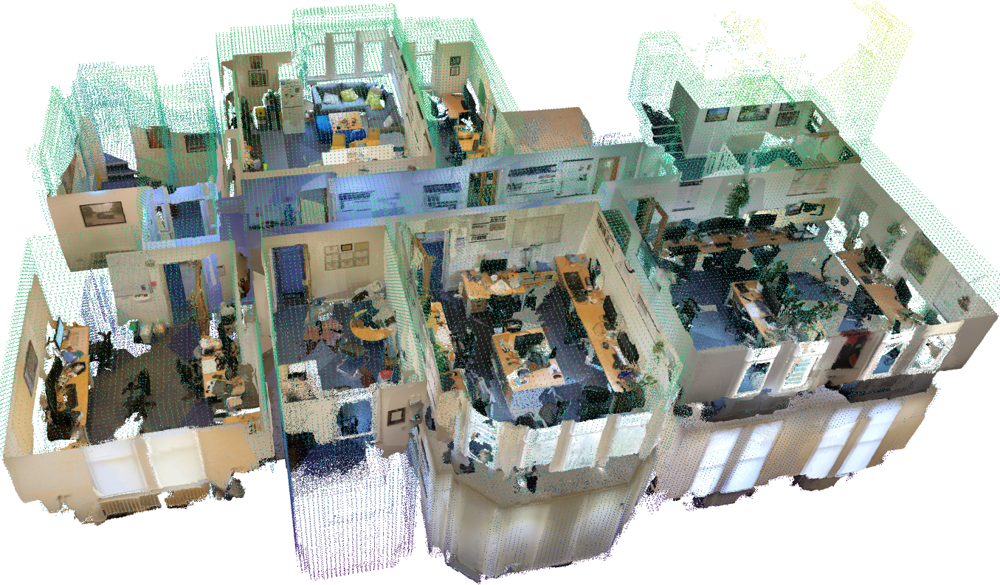
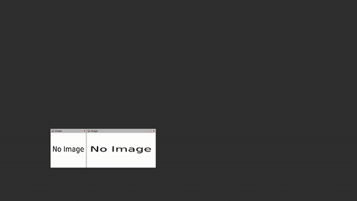
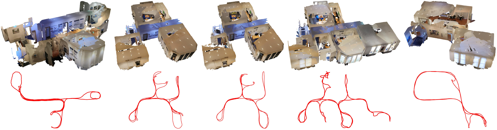

<div align="center">
  <h1>ScaRF-SLAM🧣: Scale-Consistent Reconstruction with Feed-Forward Models and Classical Visual SLAM</h1>
  <p>
    <a href="https://yuhaozhang7.github.io" target="_blank">Yuhao Zhang</a><sup>1</sup>,
    <a href="https://yifutao.github.io/" target="_blank">Yifu Tao</a><sup>1</sup>,
    <a href="https://scholar.google.com/citations?user=ZxXBaswAAAAJ&hl=en&oi=ao" target="_blank">Frank Dellaert</a><sup>2</sup>,
    <a href="https://scholar.google.com/citations?user=BqV8LaoAAAAJ&hl=en&oi=ao" target="_blank">Maurice Fallon</a><sup>1</sup><br>
    <sup>1</sup>Dynamic Robot Systems Group, University of Oxford &nbsp;&nbsp;
    <sup>2</sup>Georgia Institute of Technology
  </p>

  [](https://arxiv.org/abs/2606.00307v1)
  [](https://www.youtube.com/watch?v=t1JDXg-N25U)
  [](https://www.bilibili.com/video/BV1EGVz6yESn/)
  [](https://drive.google.com/drive/folders/1yYc3ctsetFZquQLp0JlV6gAeFr_35No8)

  
</div>

ScaRF-SLAM is a dense visual mapping framework that combines the robustness of classical visual SLAM with the reconstruction capability of modern geometric foundation models (GFMs). Instead of relying on learned geometry for camera tracking, ScaRF-SLAM decouples localization and dense mapping: classical SLAM provides accurate, low-latency pose estimation, while GFMs are used exclusively for feed-forward depth prediction and reconstruction. By anchoring dense mapping to reliable SLAM poses and enforcing lightweight scale-consistency optimization across frames and submaps, the system achieves globally consistent, high-quality 3D reconstruction while remaining robust to limited batch sizes and loop closures. The framework is compatible with a wide range of SLAM configurations — including monocular, stereo, mono-inertial, multi-camera, and fisheye-camera systems — making it practical for real-world robotics and large-scale mapping applications.

**You can take your classical visual SLAM system and wrap ScaRF-SLAM around it!**

## 🎬 Preview 

<div align="center">
  
  
  <br>
  
  
</div>


## 📷 Real-World Dataset

We evaluate ScaRF-SLAM on a real-world dataset collected at the Oxford Robotics Institute (ORI) with accurate ground-truth camera trajectories and LiDAR point clouds for quantitative evaluation ([download link](https://drive.google.com/drive/folders/1yYc3ctsetFZquQLp0JlV6gAeFr_35No8)).

<div align="center">
  
</div>

The dataset is recorded using the front fisheye camera and IMU of an Insta360 ONE RS 1-Inch, rigidly mounted to a LiDAR–inertial mapping system. Ground-truth poses are obtained by registering the undistorted LiDAR scans to a high-precision terrestrial laser scanner map ([more detail](https://github.com/ori-drs/ScaRF-SLAM/wiki/1.-%F0%9F%93%A5-Dataset)).


## 💻 Using ScaRF-SLAM

The instructions for using ScaRF-SLAM are provided on the [wiki](https://github.com/ori-drs/ScaRF-SLAM/wiki) page.
- [📥 Dataset](https://github.com/ori-drs/ScaRF-SLAM/wiki/1.-%F0%9F%93%A5-Dataset)
- [📦 Environment Setup](https://github.com/ori-drs/ScaRF-SLAM/wiki/2.-%F0%9F%93%A6-Environment-Setup)
- [🗺️ Offline Reconstruction](https://github.com/ori-drs/ScaRF-SLAM/wiki/3.-%F0%9F%97%BA%EF%B8%8F-Offline-Reconstruction)
- [🚀 Online Reconstruction with SLAM](https://github.com/ori-drs/ScaRF-SLAM/wiki/4.-%F0%9F%9A%80-Online-Reconstruction-with-SLAM)
- [🔀 Multi-Session Mapping](https://github.com/ori-drs/ScaRF-SLAM/wiki/5.-%F0%9F%94%80-Multi%E2%80%90Session-Mapping)
- [⚙️ Configuration](https://github.com/ori-drs/ScaRF-SLAM/wiki/6.-%E2%9A%99%EF%B8%8F-Configuration)
- [📐 Evaluation](https://github.com/ori-drs/ScaRF-SLAM/wiki/7.-%F0%9F%93%90-Evaluation)


## 📄 License

This project is released under the [GNU GPL v3.0](./LICENSE). For third-party dependency licenses, refer to the repositories and packages listed in the [Environment Setup](#-environment-setup) section.

For commercial purposes, please contact the authors.


## 📚 Citation

If you find ScaRF-SLAM useful for your research, please consider citing:

```bibtex
@article{zhang2026scarfslam,
  title={{ScaRF-SLAM}: Scale-Consistent Reconstruction with Feed-Forward Models and Classical Visual SLAM},
  author={Zhang, Yuhao and Tao, Yifu and Dellaert, Frank and Fallon, Maurice},
  journal={arXiv preprint arXiv:2606.00307},
  year={2026}
}
```
